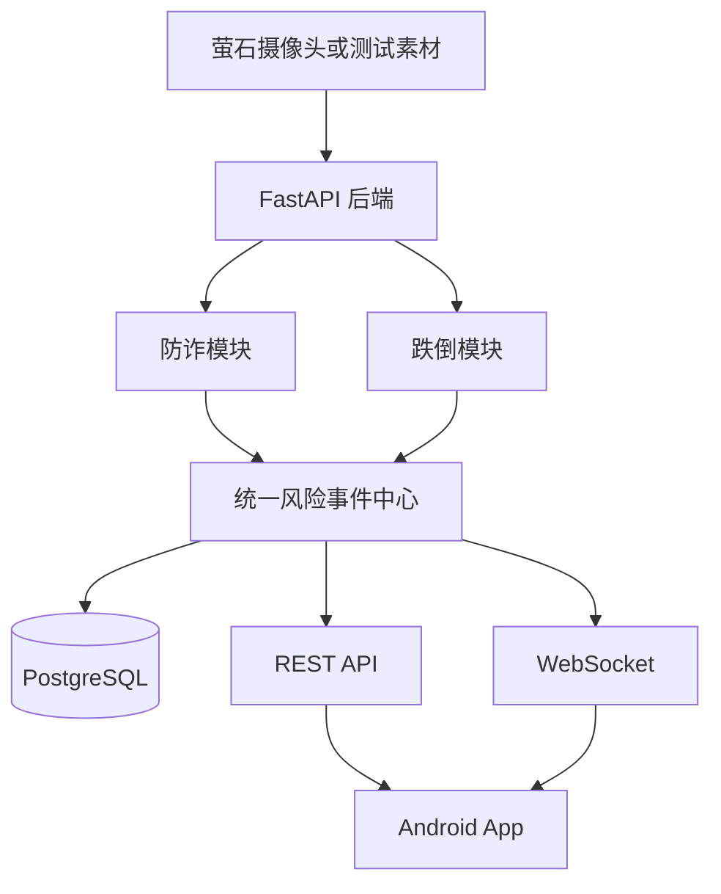

# 老年安全监测项目

本项目面向居家老年人安全监测赛题，规划通过 Android 客户端、FastAPI 后端和萤石摄像头能力，协同实现防诈识别、跌倒风险监测、统一风险事件管理和家属预警。

系统定位是辅助监测和人工决策支持，不替代公安、医疗、急救、银行或支付机构的专业判断。

## 当前状态

仓库目前已完成 **FastAPI 基础骨架**，可以启动后端并访问健康检查和 OpenAPI 文档。

- 尚未创建 Android 可运行工程；
- 已创建 FastAPI 应用工厂、配置、请求 ID、统一响应和异常处理；
- 已提供 `GET /api/v1/health` 和后端自动化测试；
- 已实现萤石事件的模拟契约接收、原文落盘、去重、异步队列和统一视觉事件查询；
- 尚未取得正式萤石 Topic、签名/解密规则和完整消息样例，因此当前接收协议不能视为正式平台对接；
- 已创建 PostgreSQL 数据库结构、SQLAlchemy Model 和 Alembic 首个迁移；
- 防诈规则、轻量文本分类、证据融合和 S0-S5 状态机已迁入，已提供转写分析和活动会话查询接口；
- 防诈风险事件已接 PostgreSQL Repository；萤石视觉事件、活动防诈会话和原始消息消费仍使用内存/文件实现；
- 已接入萤石标准直播地址取流、FFmpeg 连续音轨切块和 SenseVoiceSmall 转写；正式云信令协议、跌倒业务、统一事件查询与处置、WebSocket 尚未接入；
- 尚未提供任何准确率、召回率或实时性结论。

后续功能必须通过独立分支和 Pull Request 逐步实现，README 中的规划内容不得被表述为已完成功能。

## 规划目标

### 防诈模块

- 接收语音转写、人员数量、打电话状态和其他居家情境证据；
- 识别可疑身份接触、敏感信息试探、资金操作诱导和保密施压；
- 基于证据顺序和组合判断风险阶段，避免单关键词直接报警；
- 输出可解释的风险等级、证据链和处置建议。

### 跌倒模块

- 接收视频帧、人体框、姿态和时序信息；
- 区分正常坐卧、短时遮挡和疑似跌倒；
- 结合倒地持续时间和运动变化降低误报；
- 输出统一风险事件和必要的视觉证据。

### 公共能力

- 设备管理；
- 统一风险事件存储与状态处理；
- REST API 与 WebSocket 实时通知；
- Android 风险列表、详情和人工处置；
- 萤石设备、AI结果和云信令适配；
- Mock 模式和模块级功能开关。

## 规划架构



FastAPI 是唯一后端入口。Android 不直接调用算法脚本、不直接访问数据库，也不保存萤石 AppSecret 或其他服务端密钥。

## 技术栈

| 领域 | 选择 | 状态 |
|---|---|---|
| Android | Kotlin、Jetpack Compose、MVVM | 规划 |
| 后端 | FastAPI、Pydantic | 已落地基础骨架 |
| 数据库 | PostgreSQL、SQLAlchemy 2.x、Alembic | 已落地结构和迁移 |
| 实时通知 | WebSocket | 规划 |
| Python依赖 | uv | 已落地 |
| 测试 | Pytest、Android Unit Test | 后端已落地基础契约测试 |
| 摄像头接入 | 萤石设备能力、AI服务和云信令 | 规划 |
| 防诈推理 | 规则、字符 TF-IDF、S0-S5 状态机 | 已落地首版 |
| 语音识别 | SenseVoiceSmall、FunASR | 已落地短 WAV 音频块 |
| 媒体取流 | 萤石直播地址、FFmpeg | 已落地单设备音轨首版 |

新增依赖或正式落地规划技术时，必须同步更新本文档和对应架构决策。

## 仓库目录

```text
.
├── android/                  Android App预留目录
├── backend/                  FastAPI模块化单体
│   ├── app/
│   │   ├── api/v1/          API路由
│   │   ├── common/          公共模型和工具
│   │   ├── core/            配置、日志、安全和异常
│   │   ├── infrastructure/  数据库、存储、WebSocket和外部平台
│   │   ├── modules/         防诈、跌倒、事件、设备等业务模块
│   │   └── workers/         后台任务
│   ├── alembic/             数据库迁移
│   ├── models/              本地模型目录，不提交权重
│   ├── storage/             本地运行数据，不提交产物
│   └── tests/               契约、集成和测试夹具
├── docs/
│   ├── api/                 API契约
│   ├── architecture/        架构与设计决策
│   ├── modules/             模块设计
│   └── testing/             测试与评估规范
├── samples/                 小型脱敏测试样本预留目录
├── scripts/                 项目脚本预留目录
├── docker/                  部署文件预留目录
└── .github/workflows/       CI工作流预留目录
```

空目录通过 `.gitkeep` 保留。正式工程初始化后，可删除对应占位文件。

## 本地启动

后端要求 Python 3.12 和 [uv](https://docs.astral.sh/uv/)。首次运行：

```bash
cp .env.example .env
cd backend
uv sync --extra sensevoice --dev
uv run alembic upgrade head
uv run uvicorn app.main:app --reload
```

启动后可访问：

- 健康检查：`http://127.0.0.1:8000/api/v1/health`
- OpenAPI 文档：`http://127.0.0.1:8000/docs`
- ReDoc 文档：`http://127.0.0.1:8000/redoc`

后端提交前检查：

```bash
cd backend
uv run ruff check .
uv run ruff format --check .
uv run mypy app
uv run pytest
```

数据库初始化、Android 联调、Mock 数据和离线演示流程将在对应能力落地后补充。

本地数据库连接通过根目录 `.env` 中的 `APP_DATABASE_URL` 配置。真实用户名和密码不得写入 README 或 `.env.example`。

### 模拟萤石事件

在本地 `.env` 中启用接收器并设置临时共享令牌：

```dotenv
APP_YS7_SIGNAL_ENABLED=true
APP_YS7_WEBHOOK_TOKEN=local-demo-token
```

服务启动后发送模拟事件：

```bash
curl -X POST http://127.0.0.1:8000/api/v1/integrations/ys7/events \
  -H 'Content-Type: application/json' \
  -H 'X-YS7-Webhook-Token: local-demo-token' \
  -d '{
    "messageId": "msg-demo-001",
    "eventId": "event-demo-001",
    "deviceId": "camera-01",
    "timestamp": "2026-08-04T12:00:00+08:00",
    "eventType": "phone_call",
    "confidence": 0.91,
    "peopleCount": 1,
    "boxes": []
  }'
```

统一视觉事件通过 `GET /api/v1/fraud/visual-events` 查询。原始消息默认写入 `backend/storage/ys7/raw/`，该目录不提交 Git。

### 防诈转写分析

SenseVoice 接入前，可直接提交带时区的转写片段验证业务链路：

```bash
curl -X POST http://127.0.0.1:8000/api/v1/fraud/analyze \
  -H 'Content-Type: application/json' \
  -d '{
    "session_id": "call-demo-001",
    "source_event_id": "speech-demo-001",
    "device_id": "camera-01",
    "occurred_at": "2026-08-04T12:00:05+08:00",
    "ended_at": "2026-08-04T12:00:08+08:00",
    "text": "我是银行客服，把短信验证码告诉我",
    "elder_alone": true
  }'
```

同设备近 120 秒的萤石视觉事件会作为上下文参与状态机。活动会话当前保存在进程内存；非 S0 风险快照在数据库启用时幂等写入 `risk_events`。

### SenseVoice 音频块

安装可选模型运行时并启用功能：

```bash
cd backend
uv sync --extra sensevoice --dev
```

```dotenv
APP_SENSEVOICE_ENABLED=true
APP_SENSEVOICE_MODEL=iic/SenseVoiceSmall
APP_SENSEVOICE_DEVICE=cpu
```

随后通过 `POST /api/v1/fraud/audio/chunks` 上传不超过 15 秒的 WAV 块。后端不长期保存上传音频，SenseVoice 转写会带上由 `started_at` 换算的绝对时间并自动进入防诈状态机。完整字段见 [API 契约](docs/api/README.md)。

### 萤石直播音轨

拿到萤石参数后，在本地 `.env` 中配置：

```dotenv
APP_YS7_MEDIA_ENABLED=true
APP_YS7_APP_KEY=your-app-key
APP_YS7_APP_SECRET=your-app-secret
APP_YS7_DEVICE_SERIAL=your-device-serial
APP_YS7_CHANNEL_NO=1
APP_YS7_LIVE_PROTOCOL=flv
APP_YS7_LIVE_QUALITY=2
APP_YS7_ELDER_ALONE=false
```

也可仅配置 `APP_YS7_ACCESS_TOKEN`，但固定 Token 过期后需要人工更新；配置 AppKey/AppSecret 时，后端会自动获取并缓存 Token。启动后通过 `GET /api/v1/integrations/ys7/media/status` 查看连接、重连、队列和已处理音频块状态。

媒体 Worker 获取萤石直播地址后，通过 FFmpeg 只解码音轨为 16 kHz 单声道 PCM，每 5 秒直接调用 `FraudAudioService`。音频不落盘；当 SenseVoice 处理速度低于实时流时，有界队列会丢弃最旧块以避免告警延迟持续累积。

## 数据与隐私

- 不提交真实老人数据、完整通话、监控视频或数据库备份；
- 不提交 Token、AppSecret、设备验证码和模型服务密钥；
- 默认不长期保存连续居家音视频；
- 日志中的电话号码、身份证、银行卡和验证码必须脱敏；
- 风险结果必须标明为辅助判断，并保留人工确认流程；
- 数据集、模型和第三方SDK在使用前必须核对许可。

## 协作流程

主分支为 `master`，禁止直接推送功能代码。推荐流程：

```text
master -> feat/fraud-xxx 或 feat/fall-xxx -> Pull Request -> 审查 -> master
```

共享接口、统一事件、数据库结构和 Android 公共模块的修改必须由另一位开发者审查。完整要求见 [合作开发约束](docs/DEVELOPMENT_CONSTRAINTS.md)。

## 文档入口

- [合作开发约束](docs/DEVELOPMENT_CONSTRAINTS.md)
- [总体架构](docs/architecture/README.md)
- [API契约](docs/api/README.md)
- [防诈模块](docs/modules/fraud.md)
- [跌倒模块](docs/modules/fall.md)
- [测试与评估](docs/testing/README.md)
- [空骨架设计](docs/superpowers/specs/2026-08-04-project-skeleton-design.md)
