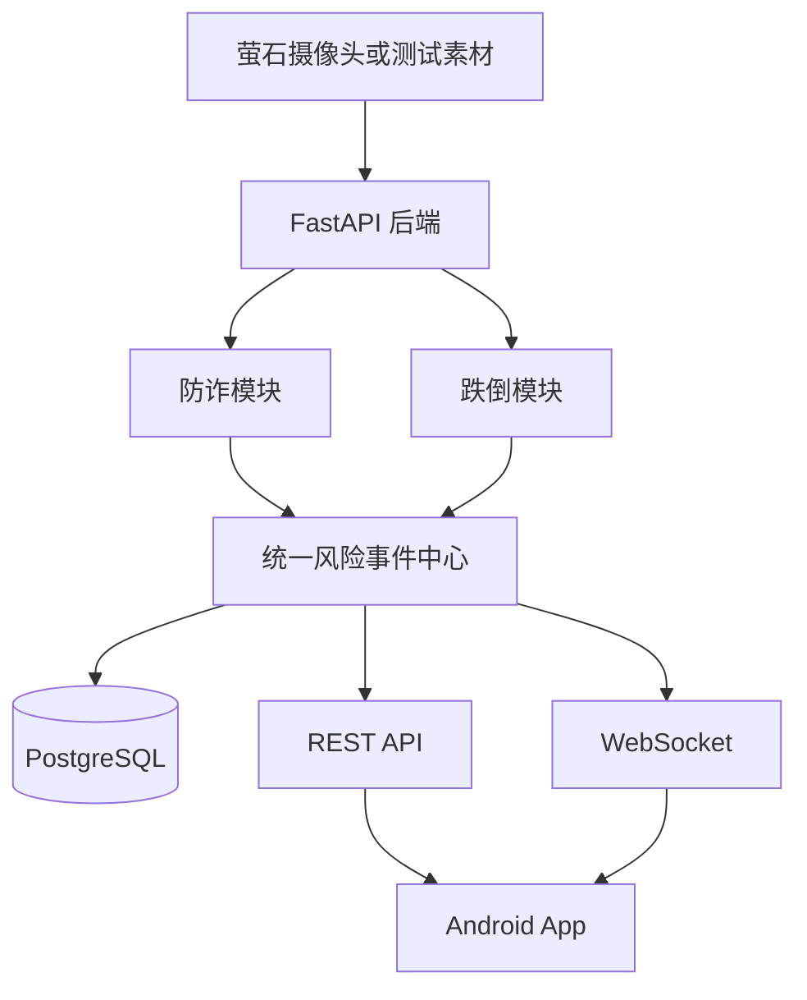

# 老年安全监测项目

本项目面向居家老年人安全监测赛题，通过 Android 客户端、FastAPI 后端和萤石摄像头能力，当前聚焦电信网络诈骗与入户诈骗的识别、分级干预和家属处置闭环。跌倒与心理关怀保留统一事件接入位，由对应模块后续实现。

系统定位是辅助监测和人工决策支持，不替代公安、医疗、急救、银行或支付机构的专业判断。

## 当前状态

仓库目前已完成 FastAPI、PostgreSQL、防诈状态机、家属端 Android App 和萤石真实直播接入，App 围绕“风险预测与提前介入”组织交互。

- Android 工程已收敛为家属端单角色，真实接口和萤石原生 H.264/H.265 直播已经接通；
- 已创建 FastAPI 应用工厂、配置、请求 ID、统一响应和异常处理；
- 已提供 `GET /api/v1/health` 和后端自动化测试；
- 已实现萤石告警列表主动轮询、模拟契约接收、原文落盘、去重、异步队列和统一视觉事件查询；
- 主动轮询不依赖公网回调；尚未取得正式萤石 Topic、签名/解密规则和完整消息样例，因此 HTTP 推送协议仍不能视为正式平台对接；
- 已创建 PostgreSQL 数据库结构、SQLAlchemy Model 和 Alembic 首个迁移；
- 防诈已采用“规则 + 校准轻量分类器 + S0-S5 状态机 + 异步 LLM 复核”四层决策，LLM 不作为首判和唯一报警依据；
- 防诈风险事件和防诈会话已接 PostgreSQL Repository，会话支持重启恢复；萤石统一视觉事件和原始消息消费仍使用内存/文件实现；
- 已接入萤石标准直播地址、Android 原生直播和前台持续守护；页面关闭后由服务静音转发 EZOpenSDK PCM，随后进入 WebRTC VAD、Paraformer 600 ms 流式转写和 SenseVoiceSmall 终句复核；风险事件事务提交后通过一次性票据 WebSocket 推送系统通知；
- 当前产品范围只实现防诈，跌倒和心理关怀不展示模拟结果；
- 尚未提供任何准确率、召回率或实时性结论。

后续功能必须通过独立分支和 Pull Request 逐步实现，README 中的规划内容不得被表述为已完成功能。

## 规划目标

### 防诈模块

- 接收语音转写、人员数量、打电话状态和其他居家情境证据；
- 识别可疑身份接触、敏感信息试探、资金操作诱导和保密施压；
- 基于证据顺序和组合判断风险阶段，避免单关键词直接报警；
- 输出可解释的风险等级、证据链和处置建议。

### 跌倒模块

- 接收视频帧、人体框、姿态和时序信息；
- 区分正常坐卧、短时遮挡和疑似跌倒；
- 结合倒地持续时间和运动变化降低误报；
- 输出统一风险事件和必要的视觉证据。

### 公共能力

- 设备管理；
- 统一风险事件存储与状态处理；
- REST API 与 WebSocket 实时通知；
- Android 风险列表、详情和人工处置；
- 萤石设备、AI结果和云信令适配；
- Mock 模式和模块级功能开关。

## 规划架构



FastAPI 是唯一后端入口。Android 不直接调用算法脚本、不直接访问数据库，也不保存萤石 AppSecret 或其他服务端密钥。

## 技术栈

| 领域 | 选择 | 状态 |
|---|---|---|
| Android | Kotlin、Jetpack Compose、MVVM | 已落地首版，防诈交互重构中 |
| 后端 | FastAPI、Pydantic | 已落地基础骨架 |
| 数据库 | PostgreSQL、SQLAlchemy 2.x、Alembic | 已落地结构和迁移 |
| 实时通知 | 一次性票据 WebSocket、Android 系统通知 | 已落地单进程实时推送 |
| Python依赖 | uv | 已落地 |
| 测试 | Pytest、Android Unit Test | 后端已落地基础契约测试 |
| 摄像头接入 | 萤石设备能力、AI服务和云信令 | 直播与告警主动轮询已落地，正式推送待确认 |
| 防诈推理 | 规则、校准字符 TF-IDF、S0-S5、LLM 复核 | 已落地四层决策 |
| 语音识别 | Paraformer Streaming、SenseVoiceSmall、FunASR | 已落地流式部分转写与终句复核 |
| 媒体取流 | Android 前台服务、EZOpenSDK PCM、FFmpeg、WebRTC VAD | 已落地单设备持续音轨；强制停止 App 后终止 |

新增依赖或正式落地规划技术时，必须同步更新本文档和对应架构决策。

## 仓库目录

```text
.
├── android/                  Android App（Compose、MVVM、萤石原生直播）
├── backend/                  FastAPI模块化单体
│   ├── app/
│   │   ├── api/v1/          API路由
│   │   ├── common/          公共模型和工具
│   │   ├── core/            配置、日志、安全和异常
│   │   ├── infrastructure/  数据库、存储、WebSocket和外部平台
│   │   ├── modules/         防诈、跌倒、事件、设备等业务模块
│   │   └── workers/         后台任务
│   ├── alembic/             数据库迁移
│   ├── models/              本地模型目录，不提交权重
│   ├── storage/             本地运行数据，不提交产物
│   └── tests/               契约、集成和测试夹具
├── docs/
│   ├── api/                 API契约
│   ├── architecture/        架构与设计决策
│   ├── modules/             模块设计
│   └── testing/             测试与评估规范
├── samples/                 小型脱敏测试样本预留目录
├── scripts/                 项目脚本预留目录
├── docker/                  部署文件预留目录
└── .github/workflows/       CI工作流预留目录
```

空目录通过 `.gitkeep` 保留。正式工程初始化后，可删除对应占位文件。

## 本地启动

后端要求 Python 3.12 和 [uv](https://docs.astral.sh/uv/)。首次运行：

```bash
cp .env.example .env
cd backend
uv sync --extra sensevoice --dev
uv run alembic upgrade head
uv run uvicorn app.main:app --reload
```

启动后可访问：

- 健康检查：`http://127.0.0.1:8000/api/v1/health`
- OpenAPI 文档：`http://127.0.0.1:8000/docs`
- ReDoc 文档：`http://127.0.0.1:8000/redoc`

本地 Demo 种子会创建可配置的登录账号：

| 端 | 账号 | 密码 |
|---|---|---|
| 家属端 | `guardian` | `guardian123` |
| 老人端 | `elder` | `elder123` |

姓名、账号和密码均可通过根目录 `.env` 的 `APP_DEMO_GUARDIAN_*`、`APP_DEMO_ELDER_*` 配置修改；修改后需重启后端并重新执行 `docker compose exec backend uv run --no-sync python -m app.scripts.seed_demo` 刷新种子。App 页面从登录用户和守护关系读取姓名，不再使用客户端固定姓名。

后端提交前检查：

```bash
cd backend
uv run ruff check .
uv run ruff format --check .
uv run mypy app
uv run pytest
```

数据库初始化、Android 联调、Mock 数据和离线演示流程将在对应能力落地后补充。

本地数据库连接通过根目录 `.env` 中的 `APP_DATABASE_URL` 配置。真实用户名和密码不得写入 README 或 `.env.example`。

## Docker Compose 启动

安装 Docker Desktop 后，从 GitHub 克隆仓库即可启动后端和 PostgreSQL：

```bash
git clone https://github.com/w0nderful-yzh/tzb-yingshi-app.git
cd tzb-yingshi-app
docker compose up --build -d
```

Compose 会等待 PostgreSQL 就绪，自动执行 Alembic 迁移，并幂等初始化 Android 联调需要的 Demo 用户和设备。无需预先安装 Python、uv 或 PostgreSQL。启动状态和日志可通过以下命令查看：

```bash
docker compose ps
docker compose logs -f backend
curl http://127.0.0.1:8000/api/v1/health
```

接口文档位于 `http://127.0.0.1:8000/docs`。Android 模拟器仍需执行 `adb reverse tcp:8000 tcp:8000`；Android App 本身不在容器中构建。

需要萤石、LLM 或其他可选能力时，先复制配置模板并填写自己的密钥，再重新启动：

```bash
cp .env.example .env
docker compose up --build -d
```

SenseVoice 会显著增大镜像体积，因此默认不安装。需要实时语音识别时，在 `.env` 中设置 `INSTALL_SENSEVOICE=true`，同时按下文配置萤石媒体参数。Docker 镜像固定使用同版本的 CPU-only Torch/Torchaudio，不下载 NVIDIA CUDA 运行时；Compose 内的数据库地址由 `TZB_DB_NAME`、`TZB_DB_USER` 和 `TZB_DB_PASSWORD` 生成，不使用宿主机的 `APP_DATABASE_URL`。

### Windows + NVIDIA RTX 4060 GPU 加速（可选规划）

组员在 Windows 10/11 和 NVIDIA RTX 4060 电脑上运行时，可以通过 Docker Desktop 的 WSL 2 后端将 GPU 提供给 Linux 容器，用于加速 SenseVoice 和 Paraformer 的模型推理。宿主机需要安装支持 WSL 2 的最新 NVIDIA 驱动、更新 WSL，并在 Docker Desktop 中启用 WSL 2 后端；可按 [Docker Desktop GPU 官方说明](https://docs.docker.com/desktop/features/gpu/)完成准备和验证。

```powershell
wsl --update
nvidia-smi
docker run --rm -it --gpus=all nvcr.io/nvidia/k8s/cuda-sample:nbody nbody -gpu -benchmark
```

当前仓库的默认 Docker 镜像仍是已经验证过的 CPU-only 版本，**现阶段仅设置 `APP_SENSEVOICE_DEVICE=cuda:0` 或给容器开放 GPU 并不能启用 CUDA**。正式提供 GPU 版本时，需要保留默认 CPU 镜像作为兼容和回退方案，并另外完成以下工作：

1. 增加独立的 GPU Dockerfile 或 Compose override，显式向 `backend` 容器开放 NVIDIA GPU；
2. 在 GPU 构建目标中将 CPU-only Torch/Torchaudio 替换为与驱动兼容的官方 CUDA wheel，并独立锁定依赖，具体版本通过 [PyTorch 安装选择器](https://pytorch.org/get-started/locally/)确认；
3. 将 `APP_SENSEVOICE_DEVICE` 和 `APP_STREAMING_ASR_DEVICE` 设置为经过实机验证的 CUDA 设备，例如 `cuda:0`；
4. 构建后先确认容器内 `torch.cuda.is_available()` 为 `True`，再进行实时音轨端到端测试和性能对比。

```bash
docker compose exec backend uv run --no-sync python -c "import torch; print(torch.cuda.is_available()); print(torch.cuda.get_device_name(0))"
```

RTX 4060 主要优化语音模型推理延迟和高并发时的任务积压，不会加速 PostgreSQL、普通 API、萤石网络取流，也不会自动提高识别准确率。实际收益取决于语音片段长度、并发量、模型和 CUDA 依赖版本；GPU 初始化或推理失败时应回退到默认 CPU 部署。

停止服务不会删除数据；如需连同本地 Docker 数据卷一起重置，可执行：

```bash
docker compose down -v
```

### 模拟萤石事件

在本地 `.env` 中启用接收器并设置临时共享令牌：

```dotenv
APP_YS7_SIGNAL_ENABLED=true
APP_YS7_WEBHOOK_TOKEN=local-demo-token
```

服务启动后发送模拟事件：

```bash
curl -X POST http://127.0.0.1:8000/api/v1/integrations/ys7/events \
  -H 'Content-Type: application/json' \
  -H 'X-YS7-Webhook-Token: local-demo-token' \
  -d '{
    "messageId": "msg-demo-001",
    "eventId": "event-demo-001",
    "deviceId": "camera-01",
    "timestamp": "2026-08-04T12:00:00+08:00",
    "eventType": "phone_call",
    "confidence": 0.91,
    "peopleCount": 1,
    "boxes": []
  }'
```

统一视觉事件通过 `GET /api/v1/fraud/visual-events` 查询。原始消息默认写入 `backend/storage/ys7/raw/`，该目录不提交 Git。

### 主动查询萤石告警

没有公网回调地址时，后端可以直接查询萤石设备告警列表：

```dotenv
APP_YS7_SIGNAL_ENABLED=true
APP_YS7_ALARM_POLL_ENABLED=true
APP_YS7_ALARM_POLL_INTERVAL_SECONDS=5
APP_YS7_ALARM_POLL_LOOKBACK_SECONDS=120
APP_YS7_ALARM_POLL_PAGE_SIZE=50
APP_YS7_APP_KEY=your-app-key
APP_YS7_APP_SECRET=your-app-secret
APP_YS7_DEVICE_SERIAL=your-device-serial
```

比赛和短时演示默认每 5 秒查询一次，设备告警发现延迟平均约 2.5 秒、最坏约 5 秒；仍回看最近 120 秒，并按萤石 `alarmId` 去重。明确的人体感应、人脸或文本标识的人形告警会转换为 `person_detected`；明确包含打电话或通话语义的 AI 告警转换为 `phone_call`；普通移动侦测不会冒充人体检测。

萤石个人版当前峰值额度为 20 次/分钟、总额度为 1 万次/天。5 秒轮询为 12 次/分钟，适合比赛但若全天运行会达到 17,280 次/天；个人版 24 小时运行时应将间隔改为 10 秒，或使用正式消息回调。通过状态接口观察实际运行结果：

```bash
curl http://127.0.0.1:8000/api/v1/integrations/ys7/status
```

重点检查 `poller_running`、`polls_completed`、`alarms_seen`、`signals_accepted`、`last_ignored_alarm_type` 和 `polling_last_error`。若设备返回了尚未适配的类型，先根据 `last_ignored_alarm_type` 和后端日志补充映射，不要直接把所有移动告警当作有人。

### 防诈转写分析

SenseVoice 接入前，可直接提交带时区的转写片段验证业务链路：

```bash
curl -X POST http://127.0.0.1:8000/api/v1/fraud/analyze \
  -H 'Content-Type: application/json' \
  -d '{
    "session_id": "call-demo-001",
    "source_event_id": "speech-demo-001",
    "device_id": "camera-01",
    "occurred_at": "2026-08-04T12:00:05+08:00",
    "ended_at": "2026-08-04T12:00:08+08:00",
    "text": "我是银行客服，把短信验证码告诉我",
    "elder_alone": true
  }'
```

同设备近 120 秒的萤石视觉事件会作为上下文参与状态机。启用数据库后，活动会话写入 `fraud_sessions` 并可在进程重启后恢复；非 S0 风险快照幂等写入 `risk_events`。

### SenseVoice 音频块

安装可选模型运行时并启用功能：

```bash
cd backend
uv sync --extra sensevoice --dev
```

```dotenv
APP_SENSEVOICE_ENABLED=true
APP_SENSEVOICE_MODEL=iic/SenseVoiceSmall
APP_SENSEVOICE_DEVICE=cpu
APP_STREAMING_ASR_ENABLED=true
APP_STREAMING_ASR_MODEL=paraformer-zh-streaming
APP_STREAMING_ASR_DEVICE=cpu
APP_STREAMING_ASR_HOTWORDS=验证码 安全账户 屏幕共享 远程控制 涉案资金 转账 汇款 取现
```

随后通过 `POST /api/v1/fraud/audio/chunks` 上传不超过 15 秒的 WAV 块。后端不长期保存上传音频，SenseVoice 转写会带上由 `started_at` 换算的绝对时间并自动进入防诈状态机。完整字段见 [API 契约](docs/api/README.md)。

### 萤石直播音轨

拿到萤石参数后，在本地 `.env` 中配置：

```dotenv
APP_YS7_MEDIA_ENABLED=true
APP_YS7_MEDIA_SOURCE=app_relay
APP_YS7_APP_KEY=your-app-key
APP_YS7_APP_SECRET=your-app-secret
APP_YS7_DEVICE_SERIAL=your-device-serial
APP_YS7_CHANNEL_NO=1
APP_YS7_LIVE_PROTOCOL=flv
APP_YS7_LIVE_QUALITY=2
APP_YS7_ELDER_ALONE=false
```

`app_relay` 是当前 C6c 的推荐配置：标准 FLV/HLS/RTMP 地址没有音轨时，用户在 App“我的”页显式开启持续守护，Android 前台服务从 EZOpenSDK 取得解码后的 16 kHz 单声道 PCM，每 1 秒向鉴权接口 `POST /api/v1/devices/{device_id}/audio-pcm` 发送一次。该 1 秒仅是网络传输批次，不是识别切句；后端仍把数据还原为连续 20 ms 帧，并由 VAD 按自然停顿切句。手机扬声器保持静音，不影响 PCM 转发。

持续守护不依赖直播页面：返回桌面、切换页面或锁屏后仍运行，并显示不可静默隐藏的常驻状态通知。用户从系统设置强制停止 App 后服务会终止；当前 Android 平台限制下不得宣称强制停止后仍可运行。

若某个设备的云直播地址已确认包含 AAC 音轨，可改为 `APP_YS7_MEDIA_SOURCE=cloud`，由后端 FFmpeg 直接解码，此模式不依赖 App 在线。也可仅配置 `APP_YS7_ACCESS_TOKEN`，但固定 Token 过期后需要人工更新；配置 AppKey/AppSecret 时，后端会自动获取并缓存 Token。启动后通过 `GET /api/v1/integrations/ys7/media/status` 查看 `source`、连接、重连、队列和已处理语音片段状态。

媒体 Worker 统一接收 16 kHz 单声道 PCM。WebRTC VAD 按自然停顿生成语音片段：连续语音 200 ms 起段、静音 700 ms 收段，前后各保留 300 ms；连续讲话达到 10 秒时强制切分，并为下一段重叠保留 1 秒。讲话期间 Paraformer 每 600 ms 更新一次 `PARTIAL` 转写，部分结果最多推动到 S2 且不写告警；自然停顿后 SenseVoice 对完整语句给出 `FINAL` 转写和语言、情绪、声音事件标签，再替换同一条部分证据并允许进入 S3-S5。重叠终句按绝对时间和文本相似度去重。音频不落盘；有界队列积压时丢弃最旧任务，避免告警延迟持续累积。

防诈会话不是进程级永久会话：第一段有效语音或新的 `phone_call` 事件创建会话，连续静音 30 秒或会话运行满 10 分钟后，下一段语音创建新会话。新会话开始时旧会话持久化为 `CLOSED`。

## 数据与隐私

- 不提交真实老人数据、完整通话、监控视频或数据库备份；
- 不提交 Token、AppSecret、设备验证码和模型服务密钥；
- 默认不长期保存连续居家音视频；
- 日志中的电话号码、身份证、银行卡和验证码必须脱敏；
- 风险结果必须标明为辅助判断，并保留人工确认流程；
- 数据集、模型和第三方SDK在使用前必须核对许可。

## 协作流程

主分支为 `master`，禁止直接推送功能代码。推荐流程：

```text
master -> feat/fraud-xxx 或 feat/fall-xxx -> Pull Request -> 审查 -> master
```

共享接口、统一事件、数据库结构和 Android 公共模块的修改必须由另一位开发者审查。完整要求见 [合作开发约束](docs/DEVELOPMENT_CONSTRAINTS.md)。

## 文档入口

- [合作开发约束](docs/DEVELOPMENT_CONSTRAINTS.md)
- [总体架构](docs/architecture/README.md)
- [API契约](docs/api/README.md)
- [防诈模块](docs/modules/fraud.md)
- [防诈优先 App 与跨模块协作说明](docs/product/fraud-first-app.md)
- [跌倒模块](docs/modules/fall.md)
- [测试与评估](docs/testing/README.md)
- [空骨架设计](docs/superpowers/specs/2026-08-04-project-skeleton-design.md)
