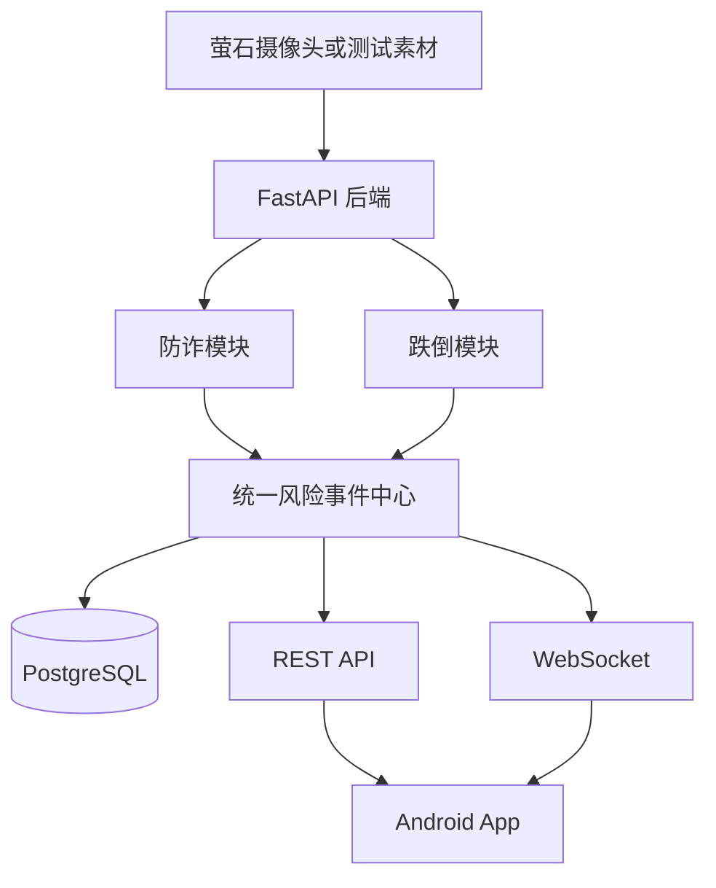

# 老年安全监测项目

本项目面向居家老年人安全监测赛题，规划通过 Android 客户端、FastAPI 后端和萤石摄像头能力，协同实现防诈识别、跌倒风险监测、统一风险事件管理和家属预警。

系统定位是辅助监测和人工决策支持，不替代公安、医疗、急救、银行或支付机构的专业判断。

## 当前状态

仓库目前只完成了**工程目录和协作文档初始化**。

- 尚未创建 Android 可运行工程；
- 尚未创建 FastAPI 可运行服务；
- 尚未接入数据库、模型、萤石平台或 WebSocket；
- 尚未提供任何准确率、召回率或实时性结论。

后续功能必须通过独立分支和 Pull Request 逐步实现，README 中的规划内容不得被表述为已完成功能。

## 规划目标

### 防诈模块

- 接收语音转写、人员数量、打电话状态和其他居家情境证据；
- 识别可疑身份接触、敏感信息试探、资金操作诱导和保密施压；
- 基于证据顺序和组合判断风险阶段，避免单关键词直接报警；
- 输出可解释的风险等级、证据链和处置建议。

### 跌倒模块

- 接收视频帧、人体框、姿态和时序信息；
- 区分正常坐卧、短时遮挡和疑似跌倒；
- 结合倒地持续时间和运动变化降低误报；
- 输出统一风险事件和必要的视觉证据。

### 公共能力

- 设备管理；
- 统一风险事件存储与状态处理；
- REST API 与 WebSocket 实时通知；
- Android 风险列表、详情和人工处置；
- 萤石设备、AI结果和云信令适配；
- Mock 模式和模块级功能开关。

## 规划架构



FastAPI 规划为唯一后端入口。Android 不直接调用算法脚本、不直接访问数据库，也不保存萤石 AppSecret 或其他服务端密钥。

## 技术栈规划

| 领域 | 规划选择 |
|---|---|
| Android | Kotlin、Jetpack Compose、MVVM |
| 后端 | FastAPI、Pydantic |
| 数据库 | PostgreSQL、SQLAlchemy 2.x、Alembic |
| 实时通知 | WebSocket |
| Python依赖 | uv |
| 测试 | Pytest、Android Unit Test |
| 摄像头接入 | 萤石设备能力、AI服务和云信令 |

技术栈尚未落地，首次引入依赖时必须同步更新本文档和对应架构决策。

## 仓库目录

```text
.
├── android/                  Android App预留目录
├── backend/                  FastAPI模块化单体预留目录
│   ├── app/
│   │   ├── api/v1/          API路由
│   │   ├── common/          公共模型和工具
│   │   ├── core/            配置、日志、安全和异常
│   │   ├── infrastructure/  数据库、存储、WebSocket和外部平台
│   │   ├── modules/         防诈、跌倒、事件、设备等业务模块
│   │   └── workers/         后台任务
│   ├── alembic/             数据库迁移
│   ├── models/              本地模型目录，不提交权重
│   ├── storage/             本地运行数据，不提交产物
│   └── tests/               契约、集成和测试夹具
├── docs/
│   ├── api/                 API契约
│   ├── architecture/        架构与设计决策
│   ├── modules/             模块设计
│   └── testing/             测试与评估规范
├── samples/                 小型脱敏测试样本预留目录
├── scripts/                 项目脚本预留目录
├── docker/                  部署文件预留目录
└── .github/workflows/       CI工作流预留目录
```

空目录通过 `.gitkeep` 保留。正式工程初始化后，可删除对应占位文件。

## 本地启动

当前没有可运行代码，因此没有启动命令。

未来后端和 Android 工程落地后，必须在此处补充：

- 环境要求与依赖安装；
- `.env.example` 使用方式；
- 数据库初始化和迁移；
- 后端启动与 OpenAPI 地址；
- Android 模拟器及真机联调地址；
- Mock 数据和离线演示流程；
- 测试、检查和构建命令。

## 数据与隐私

- 不提交真实老人数据、完整通话、监控视频或数据库备份；
- 不提交 Token、AppSecret、设备验证码和模型服务密钥；
- 默认不长期保存连续居家音视频；
- 日志中的电话号码、身份证、银行卡和验证码必须脱敏；
- 风险结果必须标明为辅助判断，并保留人工确认流程；
- 数据集、模型和第三方SDK在使用前必须核对许可。

## 协作流程

主分支为 `master`，禁止直接推送功能代码。推荐流程：

```text
master -> feat/fraud-xxx 或 feat/fall-xxx -> Pull Request -> 审查 -> master
```

共享接口、统一事件、数据库结构和 Android 公共模块的修改必须由另一位开发者审查。完整要求见 [合作开发约束](docs/DEVELOPMENT_CONSTRAINTS.md)。

## 文档入口

- [合作开发约束](docs/DEVELOPMENT_CONSTRAINTS.md)
- [总体架构](docs/architecture/README.md)
- [API契约](docs/api/README.md)
- [防诈模块](docs/modules/fraud.md)
- [跌倒模块](docs/modules/fall.md)
- [测试与评估](docs/testing/README.md)
- [空骨架设计](docs/superpowers/specs/2026-08-04-project-skeleton-design.md)
