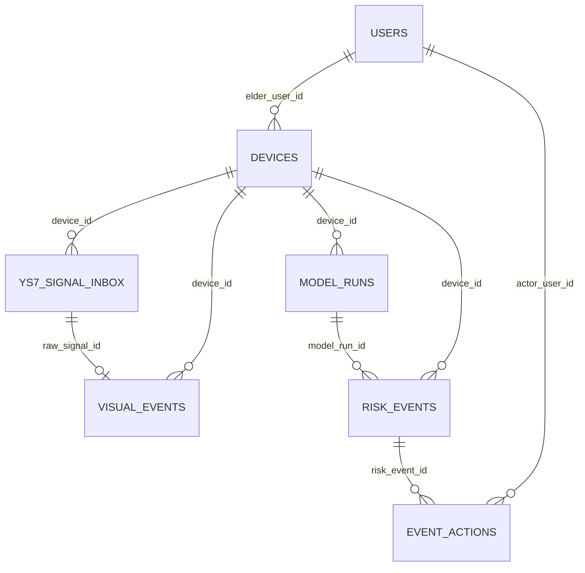

# PostgreSQL 数据库设计

## 当前状态

已接入 PostgreSQL 16、SQLAlchemy 2.x、psycopg 3 和 Alembic。首个迁移 `0bf3027fa7ee` 已在本地 `tzb_yingshi` 数据库执行。

当前已完成数据库结构和连接生命周期，防诈 Service 已通过 Repository 幂等写入 `risk_events`。萤石 Inbox、统一视觉事件和活动会话仍使用磁盘/内存实现，尚未写入对应数据库表。

## 实体关系



所有业务主键使用 UUID。`external_device_id` 同时保留在事件表中，即使设备尚未注册或后来解绑，原始事件仍然可以按供应商设备 ID 查询；`device_id` 是可空的内部外键。

## 表职责

| 表 | 所有者 | 用途 | 关键约束 |
|---|---|---|---|
| `users` | 公共 | 老人、家属和管理员基础身份 | `external_subject` 唯一；不存明文密码和完整手机号 |
| `devices` | 公共 | 摄像头及其他安全设备 | `external_device_id` 唯一；解绑用户时保留设备 |
| `ys7_signal_inbox` | 萤石接入 | 原始消息和可靠消费状态 | `dedup_key` 唯一；状态为 Pending/Processing/Processed/Failed |
| `visual_events` | 防诈/防摔共享 | 供应商消息转换后的视觉事实 | `(source, source_event_id)` 唯一；一条原始消息最多生成一条视觉事件 |
| `model_runs` | 公共 | 一次防诈或防摔算法运行记录 | 保留模型名称、版本、输入引用和运行状态 |
| `risk_events` | 统一事件中心 | 对 Android 输出的统一风险事件 | `source_event_id` 唯一；统一事件类型、风险等级和状态 |
| `event_actions` | 统一事件中心 | 家属确认、误报、处理和联系老人等审计记录 | 只追加；风险事件和操作记录禁止级联删除 |

## 时间与乱序

当前防诈 Repository 以“外部设备 ID + 会话 ID”的哈希作为稳定 `source_event_id`。同一会话从 S1 升级到 S5 时更新同一风险事件，同时保留已由人工修改的 `status`。

- `occurred_at`：摄像头、云端算法或业务模块认定的事件发生时间；
- `received_at`：FastAPI 收到消息或结果的时间；
- `created_at`：数据库写入业务记录的时间。

状态机按 `occurred_at` 重放证据，`received_at` 用于监控延迟和排查乱序。相关事件表均使用 `TIMESTAMP WITH TIME ZONE`。

## JSONB 边界

以下字段允许 JSONB：

- `ys7_signal_inbox.raw_payload`：不可变的供应商原始消息；
- `visual_events.boxes`：不同视觉算法的检测框；
- `risk_events.evidence`：防诈和防摔不同的证据详情；
- `model_runs.input_refs/output_summary`：运行输入引用与轻量结果摘要；
- `devices.settings`：低频设备配置。

事件 ID、状态、等级、时间、置信度、设备和模型版本必须使用独立列，禁止只放进 JSONB，否则无法稳定去重、过滤和建立索引。

## 索引策略

- Inbox：`(processing_status, received_at)` 支持 Worker 拉取待处理消息；
- Inbox/视觉事件：`(external_device_id, occurred_at)` 支持按设备重放；
- 风险事件：`(external_device_id, occurred_at)` 和 `(status, occurred_at)`；
- 处置记录：`(risk_event_id, created_at)`；
- 模型运行：`(device_id, started_at)`。

目前不为 JSONB 建立 GIN 索引。比赛阶段查询以结构化字段为主，等出现明确的证据内容检索需求后再增加，避免无依据的写入和存储开销。

## 删除与审计

- 用户解绑后，设备和事件中的内部用户引用置空；
- 设备删除后，事件保留外部设备 ID，内部设备外键置空；
- 原始消息被视觉事件引用时禁止删除；
- 风险事件存在处置记录时禁止删除；
- 正式业务应使用状态失效或数据保留任务，而不是直接物理删除审计链。

## 迁移命令

```bash
cd backend
uv run alembic upgrade head
uv run alembic current
uv run alembic check
```

任何后续表结构修改必须创建新的 Alembic revision，不得修改已经合入共享分支的历史迁移。
