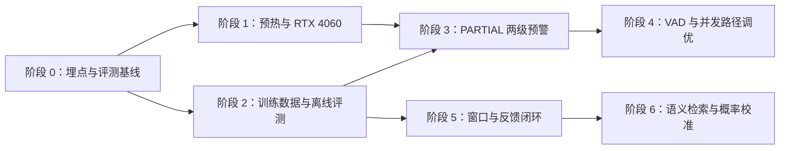

# 防诈时效性与准确性优化实施路线图

> 文档状态：实施规划，不代表以下能力已经完成。
>
> 适用范围：Android 持续守护、萤石 PCM 中继、Paraformer PARTIAL、SenseVoice FINAL、防诈状态机、统一风险事件和实时通知链路。

## 1. 目标与边界

本路线图解决两个问题：

1. 缩短高风险话术出现后，家属第一次得到有效提示的时间；
2. 在不依赖单个关键词、不放大误报的前提下，提高新型和口语化诈骗话术的检出能力。

必须继续遵守以下边界：

- PARTIAL 只用于提前发现线索，未经 FINAL 确认不得直接形成不可撤回的正式高危结论；
- 所有通知仍通过统一 `risk_events → RealtimeEventBroker → WebSocket → Android` 链路；
- 数据库事务成功后才能广播带真实 `event_id` 的事件，禁止先推送后落库；
- LLM 仍是可选异步复核，不能成为首判和唯一告警依据；
- 默认 CPU 镜像继续可用，RTX 4060 GPU 是独立的可选部署目标；
- 不提交真实老人通话、原始音频、模型权重、密钥或未脱敏反馈数据。

## 2. 已核验的当前基线

当前真实链路为：

```text
Android / 萤石音轨
        ↓ 16 kHz mono PCM
VoiceActivitySegmenter
        ├─ 每 600 ms → Paraformer PARTIAL → FraudSessionService → 最多 S2
        │                                      └─ 写 fraud_sessions，不写 risk_events
        └─ 自然停顿 700 ms
               ↓
        SenseVoice FINAL
               ↓
        FraudSessionService → 非 S0 写 risk_events → 事务提交
                                                     ↓
                                            RealtimeEventBroker
                                                     ↓
                                               Android 通知
```

需要特别注意：

- FINAL 的 S1-S5 都可能写统一风险事件并推送，不是只有 S3-S5；
- PARTIAL 不写 `risk_events`，但仍在全局锁内更新 `fraud_sessions`；
- 媒体 Worker 目前只有一个分析消费者，PARTIAL 和 FINAL 共用队列；
- `FraudAudioService` 当前用同一把锁串行保护流式识别、FINAL 识别、去重和历史记录；
- SenseVoice、Paraformer 和轻量分类器均为懒加载，第一次真实请求包含冷启动；
- 当前训练集为 94 条，其中 16 条为空标签硬负样本，各正类约 7-11 条；
- 当前 `FraudRiskSnapshot.confidence` 是参与状态转换的最强证据置信度，不是整场会话的诈骗概率；
- 尚无真实设备上的端到端 P50/P95 延迟、准确率、召回率和每设备每日误报统计。

因此，任何“优化后达到多少毫秒”或“准确率提升多少”的结论，都必须经过第 0 阶段测量后才能对外表述。

## 3. 核心指标与统一口径

### 3.1 时效性指标

| 指标 | 起点 | 终点 | 用途 |
|---|---|---|---|
| `partial_decision_latency_ms` | 风险话术对应 PCM 到达后端 | PARTIAL 状态机完成 | 判断流式识别速度 |
| `final_asr_latency_ms` | FINAL 语音段进入分析队列 | SenseVoice 返回 | 判断 CPU/GPU 推理收益 |
| `final_decision_latency_ms` | FINAL 语音段进入分析队列 | 状态机完成 | 判断模型与业务计算总耗时 |
| `event_commit_latency_ms` | 风险事件写入开始 | PostgreSQL 提交完成 | 判断数据库是否真是瓶颈 |
| `broker_publish_latency_ms` | 提交完成 | Broker 入队完成 | 判断实时广播开销 |
| `first_notice_latency_ms` | 风险话术结束 | Android 展示首次通知 | 用户感知的核心指标 |
| `confirmation_latency_ms` | 风险话术结束 | Android 收到 FINAL 确认/升级 | 正式结论时效性 |
| `analysis_queue_wait_ms` | 分析任务入队 | 开始执行 | 判断是否存在队头阻塞 |

所有指标至少区分以下维度：

- CPU / RTX 4060；
- 冷启动 / 预热后；
- 语音段长度；
- PARTIAL / FINAL；
- 单设备 / 并发设备；
- P50 / P95 / 最大值；
- 队列是否发生丢弃。

### 3.2 准确性指标

| 指标 | 说明 |
|---|---|
| 证据级 Precision / Recall / F1 | 对 11 类诈骗证据分别评估 |
| 强动作证据 Recall | 验证码、转账、远控等最关键类别不得漏检 |
| 状态级混淆矩阵 | 评估 S0-S5 是否升级正确 |
| 正常场景误报率 | 家属转账、正常客服、反诈宣传等硬负样本 |
| 每设备每日误预警数 | 衡量 PARTIAL 预警是否造成疲劳 |
| 预警确认率 | PRELIMINARY 最终被 FINAL 确认的比例 |
| 预警撤回率 | PRELIMINARY 最终被撤回的比例 |
| 证据可回指率 | 告警证据能否定位到转写原文和时间 |

## 4. 总体实施顺序



| 阶段 | 主要产出 | 是否改变用户行为 |
|---|---|---|
| 0 | 延迟埋点、回放工具、基线报告 | 否 |
| 1 | 模型预热、独立 GPU 镜像、CPU 回退 | 否 |
| 2 | 数据规范、评测集、分类器评估报告 | 否 |
| 3 | 可确认、可升级、可撤回的 PARTIAL 预警 | 是 |
| 4 | VAD 参数和队列/锁优化 | 可能 |
| 5 | 分阶段证据窗口、人工审核反馈集 | 是 |
| 6 | 语义检索、跨会话上下文、概率校准 | 是 |

后续阶段必须以前一阶段的验收数据为依据，不能为了增加功能数量跳过评测门槛。

## 5. 阶段 0：建立延迟与准确性基线

### 5.1 实现目标

先回答以下问题：

- 延迟主要来自 VAD、队列等待、SenseVoice、数据库还是 Android 网络；
- 第一次请求与预热后的差距是多少；
- PARTIAL 是否被 FINAL 推理阻塞；
- 当前规则、分类器和状态机分别在哪些场景误报或漏报；
- CPU 和 RTX 4060 的收益是否足以覆盖独立镜像维护成本。

### 5.2 后端实现路径

建议新增轻量的阶段计时对象，不立即引入完整可观测平台：

```text
backend/app/modules/fraud/latency.py
    FraudLatencyTrace
    FraudLatencyStage
    FraudLatencySnapshot
```

计时使用 `time.monotonic_ns()`，业务时间继续使用带时区 UTC。日志只记录：

- `trace_id`；
- `device_id` 的不可逆摘要；
- `session_id` 和 `source_event_id` 的摘要；
- 阶段名称、耗时、队列深度、PARTIAL/FINAL；
- 模型名、设备类型和是否预热；
- 不记录完整转写、Token、设备验证码或原始音频。

插桩位置：

| 文件 | 插桩点 |
|---|---|
| `backend/app/api/v1/routes/app_client.py` | PCM 批次进入后端 |
| `backend/app/workers/ys7_media_stream_worker.py` | VAD 起段、任务入队、任务出队、任务丢弃 |
| `backend/app/modules/fraud/audio_service.py` | Paraformer/SenseVoice 开始和结束 |
| `backend/app/modules/fraud/service.py` | 证据提取、状态机、会话持久化、事件持久化 |
| `backend/app/infrastructure/database/risk_event_repository.py` | 事务开始、提交完成、Broker 发布完成 |
| `android/.../AlertWebSocketClient.kt` | WebSocket 收到事件 |
| `android/.../Ys7MonitorService.kt` | 系统通知提交给 NotificationManager |

当前阶段先通过后端结构化日志和 Android Logcat 关联 `event_id` 计算端到端延迟，不新增包含敏感数据的线上遥测接口。

### 5.3 离线回放工具

新增：

```text
backend/app/scripts/benchmark_fraud_pipeline.py
backend/tests/fixtures/fraud_audio/README.md
```

回放工具输入本地、不提交 Git 的脱敏 WAV 清单，输出 JSON 或 CSV 报告。每条样本记录：

- 期望证据标签和状态；
- 音频时长；
- VAD 切段结果；
- PARTIAL 首次有效文本时间；
- FINAL 推理时间；
- 最终状态和证据链；
- CPU/GPU、模型版本和 Git commit。

### 5.4 测试

新增或扩展：

- `backend/tests/unit/test_fraud_latency.py`：阶段顺序、缺失阶段和耗时非负；
- `backend/tests/integration/test_ys7_media_stream_worker.py`：入队和出队使用同一 trace；
- `backend/tests/integration/test_fraud_business_flow.py`：PARTIAL、FINAL 和事件提交阶段完整；
- Android 单元测试：消息接收时间和通知时间使用同一 `event_id`，日志不包含票据。

### 5.5 验收标准

- 一条测试音轨可生成完整阶段时间线；
- CPU 冷启动、CPU 预热、RTX 4060 预热分别有基线报告；
- 至少输出 P50、P95、最大值和样本数；
- 埋点关闭时不改变业务结果；
- 埋点开销不超过总处理时间的 5%；
- 报告不得包含真实隐私数据。

## 6. 阶段 1：消除冷启动并提供 RTX 4060 可选部署

### 6.1 分类器预热

当前 `get_default_classifier()` 第一次调用会加载 `train.jsonl` 并执行 `fit()`。第一步只做启动预热，不立即引入 joblib：

1. 在 `backend/app/main.py` 的生命周期中，通过 `asyncio.to_thread(get_default_classifier)` 预热；
2. 增加 `APP_FRAUD_CLASSIFIER_WARMUP_ENABLED=true`；
3. 预热失败时记录状态，但不得阻止健康检查和非防诈接口启动；
4. 在媒体状态接口展示 `classifier_ready` 和脱敏后的 `warmup_error`；
5. 只有数据量增长到启动训练明显不可接受时，才评估序列化模型。

若以后使用 joblib，模型产物必须同时绑定：

- 训练数据 SHA-256；
- 分类器模型版本；
- scikit-learn 版本；
- 标签集合；
- 生成时间和评测报告。

数据哈希或运行库版本不匹配时必须拒绝加载，不允许静默使用旧模型。

### 6.2 ASR 模型预热

为 `SpeechRecognizer` 和 `StreamingSpeechRecognizer` 增加显式 `warmup()` 生命周期能力，禁止从 `main.py` 调用适配器私有 `_get_model()`：

```text
backend/app/modules/fraud/audio.py                  定义可选 WarmableRecognizer 协议
backend/app/infrastructure/external/sensevoice/    实现模型加载与最小空白音频预热
backend/app/main.py                                启动后台预热并维护 ready 状态
backend/app/api/v1/routes/ys7_signals.py            暴露不含密钥的模型状态
```

状态建议使用：

```text
DISABLED → WARMING_UP → READY
                    └→ FAILED
```

`/api/v1/health` 继续表示进程存活；媒体状态中的 `models_ready` 表示是否可以接收实时音轨。媒体 Worker 在模型未 READY 前不得悄悄丢弃真实音频。

### 6.3 RTX 4060 GPU 镜像

保留当前 CPU 构建，新增独立文件：

```text
docker/backend-gpu.Dockerfile
compose.gpu.yaml
docker/requirements-gpu.txt       精确锁定 CUDA Torch/Torchaudio 版本
```

GPU 目标不得直接替换 `backend/pyproject.toml` 中的 CPU-only 来源。构建流程应：

1. 复用同一后端源码和非 Torch 依赖；
2. 显式安装与组员 NVIDIA 驱动兼容的 CUDA Torch/Torchaudio；
3. Compose override 只修改 backend 构建目标、GPU 资源和设备环境变量；
4. 设置 `APP_SENSEVOICE_DEVICE=cuda:0`、`APP_STREAMING_ASR_DEVICE=cuda:0`；
5. 启动时验证 `torch.cuda.is_available()` 和设备名称；
6. GPU 初始化失败时停止媒体 Worker并给出明确状态，不得假装使用 GPU；
7. CPU 默认 Compose 继续作为无 NVIDIA 环境的回退方案。

启动示例最终应收敛为：

```powershell
docker compose -f compose.yaml -f compose.gpu.yaml up --build -d
docker compose exec backend uv run --no-sync python -c "import torch; print(torch.cuda.is_available()); print(torch.cuda.get_device_name(0))"
```

### 6.4 GPU 验收标准

- Windows + WSL 2 + RTX 4060 可以完成镜像构建、模型预热和一段完整音频分析；
- 同一评测集上，GPU 的 FINAL P95 相比 CPU 至少下降 40%，否则不承担双镜像维护成本；
- GPU 与 CPU 的状态机结果完全一致；
- 转写质量不得出现明显回退，字错误率或证据 F1 的下降必须在团队确认阈值内；
- GPU 容器重启后模型缓存可复用；
- 无 GPU 电脑继续使用原 `docker compose up --build -d`。

暂不在本阶段做 INT8 量化。量化必须作为独立实验，提供速度、内存、字错误率和证据 F1 对比后再决定。

## 7. 阶段 2：训练数据扩充与评测体系

### 7.1 先建立评测集，再扩充训练集

训练数据不能只追求数量。每条数据至少包含：

```json
{
  "text": "把短信里的验证码念给我",
  "labels": ["credential_request"],
  "source": "curated",
  "scenario": "fake_customer_service",
  "split_group": "conversation-xxx",
  "asr_noisy": false
}
```

覆盖维度：

- 同义改写和省略表达；
- 真实 ASR 错字、同音字和断句；
- 普通话、常见口语和可合法使用的方言转写；
- 多轮对话中单独看不完整的片段；
- AI 换脸、快递理赔、冒充公检法、投资养老等场景；
- 家属正常转账、银行正常提醒、反诈宣传等硬负样本；
- 同一句话在诈骗与正常上下文中的对照样本；
- protective warning，避免“不要转账”等保护性表达反向触发。

### 7.2 数据目录与隐私

建议结构：

```text
backend/app/modules/fraud/data/train.jsonl          可提交的脱敏训练数据
backend/evaluation/fraud/eval_public.jsonl          可提交的脱敏固定评测集
backend/evaluation/fraud/schema.json                字段和标签约束
backend/app/scripts/evaluate_fraud_model.py          离线评测脚本
backend/evaluation/private/                          不提交 Git
```

同一原始对话及其改写必须使用相同 `split_group`，禁止被拆到训练集和测试集造成数据泄漏。真实老人数据只允许进入受控的私有评测目录，并在使用前完成授权和脱敏。

### 7.3 训练与报告

`evaluate_fraud_model.py` 至少输出：

- 每标签 Precision、Recall、F1 和样本数；
- micro/macro F1；
- 规则独立结果、分类器独立结果和融合结果；
- 状态机 S0-S5 混淆矩阵；
- 硬负样本误报清单；
- 模型版本、数据哈希、阈值和运行环境。

首轮数据目标可以是 800-1500 条，但合入条件不是达到行数，而是：

- 11 个标签和关键正常场景均有独立训练、验证、测试覆盖；
- 每个指标有足够样本量，报告中不隐藏小样本类别；
- 强 action 类召回率和硬负样本误报率达到团队在基线后确认的门槛；
- 新模型在固定评测集上不得比旧模型回退。

### 7.4 测试

- 数据 Schema、未知标签、空文本和重复 ID 检查；
- `split_group` 不跨集合；
- 固定随机种子后报告可重复；
- protective warning 不推动风险升级；
- ASR 错字样本仍能产出预期证据；
- 分类器阈值变化必须附对比报告。

## 8. 阶段 3：PARTIAL 预警、FINAL 确认与撤回

### 8.1 设计原则

不能简单地“PARTIAL 到 S2 就通知”。S2 可能只是身份接触或通话上下文，全部推送会造成告警疲劳。

首版只允许以下强动作证据触发 PRELIMINARY：

```text
credential_request
remote_control_instruction
money_instruction
```

默认门槛：

- `transcript_status == PARTIAL`；
- `stage == action`；
- `strength == strong`；
- 融合置信度不低于 0.90；
- 同一 `source_event_id` 的连续两次 PARTIAL 均出现相同证据 kind；
- protective evidence 出现时禁止预警；
- 每个话轮最多生成一个 PRELIMINARY，后续只能更新同一事件。

门槛必须通过第 2 阶段评测集调整，不能只在代码里写一个未经验证的数字。

连续命中次数、候选 kind 和是否已经创建 PRELIMINARY，应作为当前 speech event 的 `partial_stability` 元数据写入现有 `fraud_sessions.speech_events` JSONB。这样不需要新增表字段，并且服务重启恢复会话后仍能保持幂等；不能只放在进程内字典中。

### 8.2 不新增模块私有 WebSocket

继续使用统一 `risk_event.upserted`。PRELIMINARY 必须先写 `risk_events`，获得真实数据库 ID 后再广播。

为避免第一版就增加共享状态枚举，先在 `evidence` 中增加：

```json
{
  "verification_status": "PRELIMINARY",
  "preliminary_source_event_id": "stream-partial-000000001",
  "preliminary_kind": "credential_request",
  "preliminary_created_at": "2026-08-07T12:00:00+08:00"
}
```

取值：

```text
PRELIMINARY | CONFIRMED | RETRACTED
```

使用现有按设备和会话生成的稳定 `source_event_id`，保证 PARTIAL 和 FINAL 更新同一 `risk_events` 行。

### 8.3 状态流转

```text
PARTIAL 强动作连续命中
        ↓
PRELIMINARY：REMINDER + OPEN
        ├─ FINAL state_index >= 2 → CONFIRMED：按 S2-S5 更新等级
        └─ FINAL state_index < 2  → RETRACTED：状态改 RESOLVED，记录系统撤回原因
```

首版确认门槛为 S2，后续只能根据评测结果配置化调整。FINAL 若只剩 S0-S1，不得把 PARTIAL 预警静默留在开放事件列表中。

撤回不是家属人工“已处理”。Repository 应增加一条 actor 为空的系统 `RESOLVE` action，并在 metadata 中记录：

```json
{
  "reason": "final_transcript_retracted_preliminary",
  "source": "FRAUD_ENGINE"
}
```

### 8.4 后端修改路径

| 文件 | 修改内容 |
|---|---|
| `backend/app/modules/fraud/service.py` | 维护每话轮连续命中状态；生成 preliminary/confirm/retract 决策 |
| `backend/app/modules/fraud/ports.py` | 为风险事件写入补充 verification status，不泄漏 SQLAlchemy 类型 |
| `backend/app/infrastructure/database/risk_event_repository.py` | 同一事件幂等更新；事务后广播；支持系统撤回 |
| `backend/app/infrastructure/realtime_events.py` | Payload 增加 `verification_status` |
| `backend/app/modules/app_client/schemas.py` | 列表和详情返回 verification status |
| `backend/app/modules/app_client/service.py` | 从 evidence 映射验证状态；RETRACTED 不计入开放预警 |
| `docs/api/app-client-api.md` | 先更新字段、状态语义和示例 |

当前 `risk_events.status` 枚举可以继续使用，不立即新增数据库状态。若后续产品需要单独查询“系统撤回”，再通过独立迁移增加专用状态，不能重写历史迁移。

### 8.5 Android 修改路径

| 文件 | 修改内容 |
|---|---|
| `android/.../data/model/Models.kt` | `RealtimeRiskEvent`、列表和详情增加 verification status |
| `android/.../data/realtime/AlertWebSocketClient.kt` | 保持只接收统一 `risk_event.upserted` |
| `android/.../data/media/Ys7MonitorService.kt` | PRELIMINARY 低打扰通知；CONFIRMED 更新同 ID；RETRACTED 取消同 ID 通知 |
| `android/.../ui/screens/alerts/` | 开放列表过滤 RETRACTED；历史中可展示“系统已撤回” |

通知规则：

- PRELIMINARY：标题注明“实时监测中，待确认”，使用 REMINDER，不提供高危处置措辞；
- CONFIRMED：使用同一个 `event_id.hashCode()` 更新原通知，按正式告警级别展示；
- RETRACTED：调用 `NotificationManager.cancel(event_id.hashCode())`，不再次弹出声音通知；
- 点击 PRELIMINARY 必须能查询到数据库详情，不允许发送虚假 ID。

### 8.6 测试矩阵

后端至少覆盖：

1. 单次不稳定 PARTIAL 不预警；
2. 连续两次相同强动作生成一个 PRELIMINARY；
3. 重复 PARTIAL 不新增事件；
4. FINAL 确认后更新同一事件；
5. FINAL 回落后撤回同一事件；
6. protective warning 阻止预警；
7. DB 事务失败时不广播；
8. 无绑定家属时不越权广播；
9. 进程重启恢复会话后不会重复创建 PRELIMINARY；
10. LLM 不参与 PARTIAL 首次预警。

Android 至少覆盖：

1. PRELIMINARY 创建低打扰通知；
2. CONFIRMED 使用相同 ID 更新通知；
3. RETRACTED 取消通知；
4. 重复消息不重复弹出；
5. 断线重连后以 REST 开放事件为准补齐；
6. 不认识新字段的旧客户端仍能解析公共消息。

### 8.7 上线门槛

先用 Feature Flag 灰度：

```env
APP_FRAUD_PRELIMINARY_ALERT_ENABLED=false
APP_FRAUD_PRELIMINARY_MIN_CONFIDENCE=0.90
APP_FRAUD_PRELIMINARY_STABLE_REVISIONS=2
APP_FRAUD_PRELIMINARY_CONFIRM_MIN_STATE_INDEX=2
```

只有满足以下条件才默认开启：

- 首次有效提示 P95 明显优于仅 FINAL 基线；
- PRELIMINARY 确认率达到团队评审门槛；
- 每设备每日误预警数在可接受范围；
- 撤回消息和 Android 取消通知端到端测试通过；
- 不降低 FINAL 正式告警召回率；
- 用户文案明确区分“待确认”和“正式告警”。

## 9. 阶段 4：VAD、队列和锁优化

本阶段必须由 `analysis_queue_wait_ms` 和回放结果触发，不能凭感觉重构。

### 9.1 VAD 参数化与回放

第一轮只评估 `SILENCE_END_MS`：

```text
500 ms / 600 ms / 700 ms
```

暂时保持：

```text
SPEECH_START_MS = 200
STREAMING_CHUNK_MS = 600
```

原因：

- `SPEECH_START_MS` 主要影响起段和 PARTIAL，不是话术结束后的主要固定延迟；
- 当前 20ms 帧要求所有 VAD 参数是 20 的整数倍；
- Paraformer 当前适配按 600ms 增量运行，改为 400ms 必须单独验证模型稳定性；
- 静音切段产生的相邻段通常没有时间重叠，不能依赖现有 SequenceMatcher 自动消除所有过度切分。

新增配置建议：

```env
APP_YS7_VAD_SPEECH_START_MS=200
APP_YS7_VAD_SILENCE_END_MS=700
APP_STREAMING_CHUNK_MS=600
```

Pydantic 校验必须限制范围并要求为 20ms 的整数倍。

回放报告比较：

- FINAL 产出时间；
- 话轮过度切分率；
- 不同句子错误合并率；
- 字错误率和证据 F1；
- PRELIMINARY 确认率；
- 每分钟 SenseVoice 调用次数。

只有在准确性不回退且 P95 有实际收益时才修改默认值。

### 9.2 消除 PARTIAL/FINAL 队头阻塞

若基线显示 FINAL 推理期间 PARTIAL 队列等待显著增加，按以下顺序改造：

1. `Ys7MediaStreamWorker` 拆分有界 `streaming_queue` 和 `final_queue`；
2. 两个队列分别使用独立消费任务；
3. `FraudAudioService` 将当前全局锁拆为：
   - 每个 `source_event_id` 的流式会话锁；
   - 每个 `(device_id, session_id, chunk_id)` 的 FINAL 幂等锁；
   - 每个 `(device_id, session_id)` 的转写历史锁；
4. SenseVoice 和 Paraformer 适配器继续保留各自的推理并发限制；
5. 同一 GPU 上是否允许两模型并行由显存和 P95 基准决定；
6. 队列仍保持有界，积压时记录丢弃原因和任务类型。

拆队列后必须保证同一话轮的 FINAL 可以用稳定 `source_event_id` 替换之前的 PARTIAL，不允许因为并发顺序产生重复证据。

### 9.3 分设备业务锁

只有多设备动态取流落地后，再把 `FraudSessionService` 的全局锁改为按 `device_id` 的锁：

- 同一设备的不同会话仍串行，保证关闭旧会话与新会话创建一致；
- 不同设备可以并行分析；
- 锁表必须有引用计数或过期清理，避免设备 ID 无限增长；
- 数据库事务仍在对应设备锁内完成，先保证一致性；
- 不通过 fire-and-forget 绕开事件事务。

当前部署只有一个配置设备，提前只改这把锁收益有限，也不能解决 ASR 队头阻塞。

## 10. 阶段 5：分阶段证据窗口与反馈闭环

### 10.1 分阶段窗口

当前所有证据共用 120 秒窗口。建议改为配置化的阶段窗口和时间衰减：

| 证据阶段 | 建议初始窗口 | 处理方式 |
|---|---:|---|
| contact | 300 秒 | 随时间衰减，不直接形成高危状态 |
| probing | 180 秒 | 需要与 contact 或 action 组合 |
| action | 120 秒 | 保持高时效和高权重 |
| control | 120 秒 | 只在近期 action 存在时增强 |
| protective | 300 秒 | 优先抑制同一语境中的错误升级 |
| context/video | 120 秒 | 保持与视觉事件时效一致 |

实现路径：

1. 在证据进入状态机前，根据 stage 计算有效期和衰减置信度；
2. 状态机继续消费标准 evidence，不感知数据库；
3. 原始置信度和衰减后置信度都写入证据链，保证可解释；
4. contact 证据过期后不得永久把会话维持在高状态；
5. 使用 3-5 分钟建立信任后索要验证码的回放场景验证收益。

### 10.2 误报反馈闭环

不允许在用户点击 FALSE_ALARM 后直接追加 `train.jsonl`。首版采用人工审核导出：

```text
risk_events + event_actions(FALSE_ALARM)
        ↓
export_fraud_feedback.py
        ↓ 脱敏、去重、人工逐证据标注
private feedback dataset
        ↓
固定评测集验证
        ↓
人工合并到版本化 train.jsonl
```

建议新增：

```text
backend/app/scripts/export_fraud_feedback.py
backend/evaluation/fraud/feedback_review_schema.json
```

导出内容默认删除：

- 用户、设备和家属真实标识；
- 电话、身份证、银行卡、验证码等敏感实体；
- 原始音频和图片 URL；
- 与模型训练无关的家庭信息。

FALSE_ALARM 只说明整场事件不应告警，不代表其中每个证据标签都是负样本。审核人员必须逐条确认标签，防止把“确实出现转账话术但最终属于正常家属沟通”的文本错误标成所有类别负样本。

### 10.3 验收标准

- 5 分钟接触证据与近期强动作可以正确组合；
- 旧 contact 证据单独存在时不会长期维持高状态；
- 同一评测集上召回提升且正常场景误报不恶化；
- 反馈导出不包含直接身份标识；
- 训练数据更新必须附数据版本和新旧模型对比报告；
- 模型更新仍由人工审批，不做线上自动重训练和自动发布。

## 11. 阶段 6：中长期能力

### 11.1 语义检索层

只有规则与字符分类器在固定评测集上仍存在明确语义漏报时才引入。

设计约束：

- 语义库必须人工标注意图标签和标准表述；
- 新增 `SemanticEvidenceRetriever` 端口，模型加载放在基础设施适配器；
- 语义相似只生成 weak/medium evidence，不能单独推动 S4/S5；
- 诈骗话术和正常近义表达必须成对进入评测集；
- 句向量推理必须计入 PARTIAL/FINAL 延迟；
- 模型缺失时规则、分类器和状态机正常运行。

合入门槛：新增层在固定测试集上带来明确召回收益，同时硬负样本误报率和 P95 延迟不超过团队阈值。

### 11.2 跨会话近期风险画像

不直接让新会话从 S2 或更高状态起步。更安全的方式是把近期历史转换为带时间衰减的 context evidence：

```text
过去 24-72 小时 risk_events
        ↓ 按设备、状态、证据种类和时间衰减汇总
recent_session_risk context
        ↓
新会话仍从 S0 开始，但组合门槛可参考近期上下文
```

实现时新增 `RecentFraudRiskStore` 端口，由 PostgreSQL Repository 查询。近期画像不能包含完整旧转写，只保存状态、证据种类、发生时间和脱敏摘要。

### 11.3 会话级概率校准

在拥有足够的已标注完整会话前，不做 isotonic regression。满足数据条件后：

1. 从每场会话提取证据数量、阶段组合、时间跨度、视觉上下文和模型分数；
2. 按真实会话来源分组切分训练/验证/测试集；
3. 训练独立校准器输出 `fraud_probability`；
4. 保留当前 evidence confidence，避免改变字段语义；
5. API 新增明确命名的概率字段，不把旧 `confidence` 偷换含义；
6. 输出可靠性曲线、Brier score 和不同阈值下的误报/漏报。

概率只用于辅助分级和运营评估，S0-S5 的可解释证据链继续保留。

### 11.4 PARTIAL LLM 暂缓

近期不把 LLM 接到每次 PARTIAL：

- 调用时延通常无法稳定改善首次提示；
- PARTIAL 每 600ms 更新会产生重复请求和费用；
- 旧请求可能晚于新文本返回，造成乱序证据；
- 当前 LLM evidence 没有 PARTIAL 状态标记，直接接入可能绕过 S2 上限。

只有完成请求去抖、每话轮最多一次、取消过期请求、PARTIAL evidence 上限和成本监控后，才允许以 Feature Flag 进行实验。

## 12. PR 拆分建议

每个 PR 只完成一个可验证目标：

| PR | 范围 | 必须通过的检查 |
|---|---|---|
| PR-1 | 延迟 trace 与回放报告 | Ruff、Mypy、Pytest、日志脱敏测试 |
| PR-2 | 分类器和 ASR 预热 | 冷/热启动测试、失败降级测试 |
| PR-3 | GPU Dockerfile 与 Compose override | Windows RTX 4060 实机报告、CPU 回退 |
| PR-4 | 数据 Schema、评测脚本和首版评测集 | 数据泄漏检查、可重复报告 |
| PR-5 | PARTIAL preliminary 后端状态流转 | DB 事务后广播、幂等、确认、撤回、越权测试 |
| PR-6 | Android preliminary 通知 | 创建、更新、取消、重复消息、断线恢复测试 |
| PR-7 | VAD 参数化与回放选择 | 500/600/700ms 对比报告 |
| PR-8 | 双队列与锁拆分 | 顺序、并发、队列丢弃、同话轮幂等测试 |
| PR-9 | 分阶段窗口与反馈导出 | 状态机回放、隐私检查、模型对比报告 |

共享 API、数据库、Broker 和 Android DTO 的 PR 必须由另一名组员审查。

## 13. 回滚策略

| 改动 | 回滚方式 |
|---|---|
| 延迟埋点 | 关闭 Feature Flag，不影响业务结果 |
| 模型预热 | 关闭 warmup，恢复懒加载 |
| GPU 镜像 | 改回默认 `compose.yaml` CPU 部署 |
| 新分类器数据 | 恢复上一模型/数据版本和阈值 |
| PARTIAL 预警 | 关闭 `APP_FRAUD_PRELIMINARY_ALERT_ENABLED`，FINAL 链路继续工作 |
| VAD 参数 | 恢复 200/700/600ms 默认值 |
| 双队列/并发 | 恢复单分析队列，不修改事件数据结构 |
| 分阶段窗口 | 恢复统一 120 秒窗口 |
| 语义检索/近期画像/校准器 | 关闭各自 Feature Flag，保留规则和状态机主链路 |

数据库迁移一旦合入不得删除或重写；回滚应用版本时使用向后兼容字段和默认值。

## 14. 明确不做的事情

- 不在没有基线数据时承诺“首次告警缩短 50%”；
- 不把所有 PARTIAL S2 都推送给家属；
- 不先广播再 fire-and-forget 写风险事件；
- 不运行时直接改写仓库内 `train.jsonl`；
- 不在缺少完整会话标注时训练诈骗概率校准器；
- 不未经回放测试就把 600ms 流式块改成 400ms；
- 不把 150ms 语音起始、INT8 量化或语义模型描述成必然收益；
- 不为了多设备规划提前大规模重构当前单设备链路；
- 不允许 LLM evidence 绕过 PARTIAL 的 S2 安全上限；
- 不用 GPU 可用性替代准确率、误报率和端到端延迟评估。

## 15. 完成定义

整个优化项目只有同时满足以下条件才算完成：

1. 有可重复的 CPU 与 RTX 4060 延迟报告；
2. 有严格分离的训练、验证、测试数据和固定评测报告；
3. PRELIMINARY、CONFIRMED、RETRACTED 全链路可观测、可幂等、可恢复；
4. Android 能正确创建、更新和取消同一事件通知；
5. 正式告警仍然坚持数据库事务成功后广播；
6. FINAL 召回率不因时效性优化下降；
7. 每设备每日误预警数达到团队确认门槛；
8. 默认 CPU Compose 与可选 GPU Compose 都有验证记录；
9. Ruff、格式检查、Mypy、后端测试和 Android 测试全部通过；
10. README、API 契约、架构文档和模块文档与最终实现一致。
